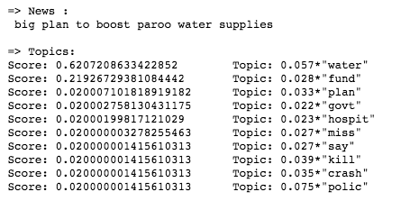

# Latent Dirichlet Allocation (LDA)

LDA is used to classify texts to a specific topic. It builds topics per document model and words per topic model. We describe latent Dirichlet allocation (LDA), a generative probabilistic model for collections of discrete data such as text corpora. LDA is a three-level hierarchical Bayesian model, in which each item of a collection is modeled as a finite mixture over an underlying set of topics. Each topic is, in turn, modeled as an infinite mixture over an underlying set of topic probabilities. In the context of text modeling, the topic probabilities provide an explicit representation of a document. Read more in <a href="http://www.jmlr.org/papers/volume3/blei03a/blei03a.pdf">"Latent Dirichlet Allocation" paper. </a>

<figure>
  
  <figcaption>Fig.1 - The intuitions behind latent Dirichlet allocation. <a href="https://cacm.acm.org/magazines/2012/4/147361-probabilistic-topic-models/fulltext">(image taken here)<\a> </figcaption>
</figure>

# Result

We used a dataset for news report. You can see the result of generated topics for the gieven report here:

<figure>
  
  <figcaption>Fig.2 - The output result for generated topics. <a href="https://cacm.acm.org/magazines/2012/4/147361-probabilistic-topic-models/fulltext">(image taken here)<\a> </figcaption>
</figure>
